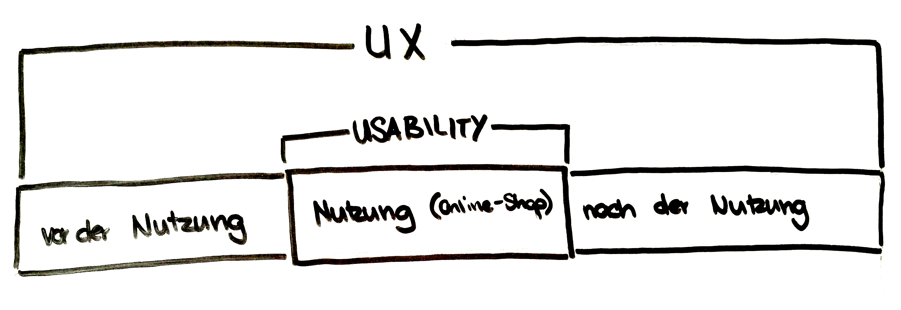
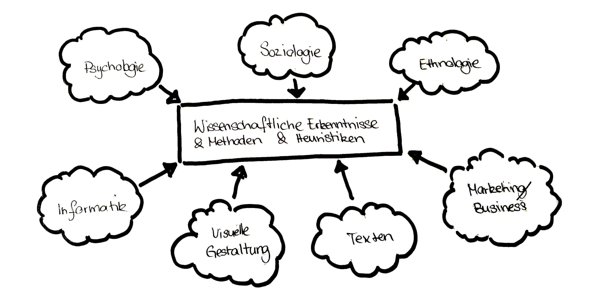

# Usability #
## User Experience (UX) ##

---

## Usability ## 
### Ein Teilgebiet der UX ###

Was genau ist denn UX und Usability

---

## ISO 9241 ##

- **User Experience**
  - **Nutzungserlebnis** oder **Nutzungserfahrung**
  - ISO 9241-210: UX umfasst demnach &raquo;*alle Aspekte der **Erfahrungen** eines Nutzer **bei der Interaktion mit einem Produkt**, **Dienst**, einer **Umgebung** oder **Einrichtung***&laquo;
 
 
 
- **Usability**
    - **Gebrauchstauglichkeit** oder **(Be-)Nutzerfreundlichkeit**
    - ISO 9241-11: Usability bezeichnet &raquo;*das Ausmaß, in dem ein Produkt, System oder Dienst durch bestimmte Benutzer in einem **bestimmten Anwendungskontext** genutzt werden kann, um **bestimmte Ziele** effektiv, effizient und zufriedenstellend zu erreichen.*&laquo;

Woher kommen die ISO-Normen

    
---

## Erkenntnisse aus Studien, Forschung und Projekten ##

Können wir nicht einfach den Nutzer fragen, was er will?

---

## Nutzer fragen: Jain! ##

Es gibt Mittel wie:
- Fokusgruppen
- Usability-Test

*zu den aber später mehr*

 
 

> Wenn ich die Menschen gefragt hätte, was sie wollen, hätten sie gesagt schnellere Pferde.

  Henry Ford (Gründer der Ford Motor Company)