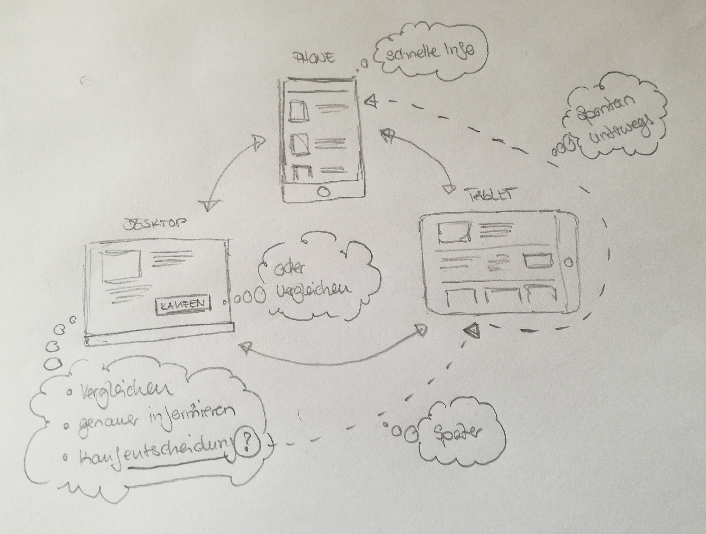

# Usability #
## User Experience (UX) ##

---

## Usability ## 
### Ein Teilgebiet der UX ###

Was genau ist denn UX und Usability

---

## ISO 9241 ##

- **User Experience**
  - **Nutzungserlebnis** oder **Nutzungserfahrung**
  - ISO 9241-210: UX umfasst demnach &raquo;*alle Aspekte der **Erfahrungen** eines Nutzer **bei der Interaktion mit einem Produkt**, **Dienst**, einer **Umgebung** oder **Einrichtung***&laquo;
----
- **Usability**
    - **Gebrauchstauglichkeit** oder **(Be-)Nutzerfreundlichkeit**
    - ISO 9241-11: Usability bezeichnet &raquo;*das Ausmaß, in dem ein Produkt, System oder Dienst durch bestimmte Benutzer in einem **bestimmten Anwendungskontext** genutzt werden kann, um **bestimmte Ziele** effektiv, effizient und zufriedenstellend zu erreichen.*&laquo;
----

Woher kommen die ISO-Normen?

    
---

## Erkenntnisse aus Studien, Forschung und Projekten ##

Können wir nicht einfach den Nutzer fragen, was er will?

---

## Nutzer fragen: Jain! ##

Es gibt Mittel wie:
- Fokusgruppen
- Usability-Test

*Dazu später mehr*

----

> Wenn ich die Menschen gefragt hätte, was sie wollen, hätten sie gesagt schnellere Pferde.
>  // Henry Ford (Gründer der Ford Motor Company)

---

## Erkenntnisse aus Studien, Forschung und Projekten ##

Was sind denn Usability Heuristiken?

---

## Die 10 Heuristiken für das Interface Design ##
Diese Punkte sollte nach <a href="https://www.nngroup.com/people/jakob-nielsen/">Jakob Nielsen</a> jedes technische System erfüllen:

- Sichtbarkeit des Systemstatus - was macht das Gerät?
- Übereinstimmung von System und Realität des Nutzers
- Kontrolle durch den Nutzer
- Konsistenz durch den Nutzer
- Fehlervermeidung
- Selbsterklärung vor Erinnerung
- Flexibilität und Effizienz
- Ästhetisches minimalistisches Design
- Hilfe beim Erkennen, Diagnostizieren und Beheben von Fehlern
- Hilfe und Dokumentation

Was gilt für Anwendungen?

---

## Menschliche Wahrnehmung ##
gilt als Grundlagen jeder guten Gestaltung.

### Kurzzeitgedächtnis nicht überfordern ###
- Millersches Gesetzt: **7 +/- 2**
  - Beispiel: Menüpunkte
- Hycksches Gesetz
  - Je mehr Auswahl, desto länger dauert eine Entscheidung
  - Fazit: Überfordert
  
---
 
## Menschliche Wahrnehmung ##
gilt als Grundlagen jeder guten Gestaltung.

### Gestaltgesetze ###
- Nähe
- Ähnlichkeit (siegt über Nähe)
- Symmetrie (siegt über Nähe)
- Geschlossenheit
- Figur und Grund

---

## Menschliche Wahrnehmung ##
gilt als Grundlagen jeder guten Gestaltung.

### weitere Erkentnisse aus der Forschung ###
- Banner-Blindheit
- Fitt's Gesetz
- Gutenberg-Diagramm und Z-Muster
- **F-Muster**
- **Wir sind gerägt Gesichter zu erkennen**

---

## Das mobile Zeitalter und die Auswirkung auf interaktive Konzepte ##

Internetnutzung: 

> Okt 2016:  
> Desktop 48,7% <> Mobile 51,3%  
> (Quelle: StatCounter Global Sats)

Mehrere Plattformen > Umdenken

---

## Das mobile Zeitalter und die Auswirkung auf interaktive Konzepte ##

---

## Das mobile Zeitalter und die Auswirkung auf interaktive Konzepte ##

- Responsive Design
  - Website muss auf verschieden Größen den Content optimal wieder geben
  - Meist: Desktop > Tablet > Phone
- Mobile First
  - Design für Mobile-Site erstellen, dann auf andere Gerätegrößen erweitern
  - Phone > Tablet > Desktop
- *Context First* Beispiel Bild vorher
  - Der Nutzungskontext wird berücksichtigt
- Touch und Gesten
  - Es wird nicht mit der Maus geklickt
  - Bsp: Kein Hover auf Mobile Devices
  
---

## Nutzerzentrierte Entwicklung ##
Den Nutzer in die Produktentwicklung einbinden

> Es geht nicht darum, was der Nutzer will, sondern viel mehr, wie es ihm hilft seine Probleme zu lösen

Dafür brauchen wir sein Feedback udn müssen erstmal verstehen für wen wir das Produkt überhaupt entwickeln.

---

## Der optimale Projektablauf ##

<table>
<tr>
<td>Phase</td>
<td>Schritte/Aktionen</td>
<td>Ausgewählte Methoden</td>
</tr>
<tr>
<td>Nutzungskontext verstehen und beschreiben</td>
<td></td>
<td>
- Fokusgruppen
- Personas
</td>
</tr>
<tr>
<td>Nutzungsanforderungen</td>
<td></td>
<td>
- Card Sorting
- Scribbles
- Wireframes
</td>
</tr>
<tr>
<td>Gestaltungslösungen entwickeln, die die Nutzungsanforderungen rfüllen (Design, Umsetzung)</td>
<td></td>
<td>
- Papierprototypen
- Mockups und Prototypen
</td>
</tr>
<tr>
<td>Gestaltungslösung aus Nutzerperspektive evaluieren (Testing)</td>
<td></td>
<td>
- Usability-Tests
- A/B Tests
</td>
</tr>
</table>